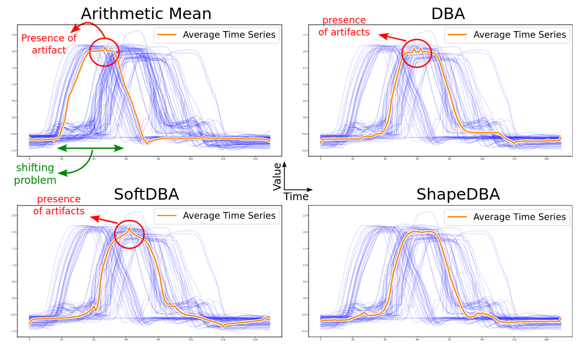
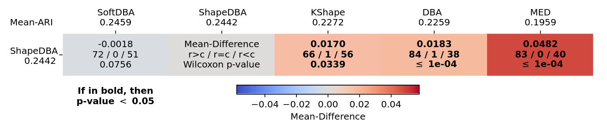
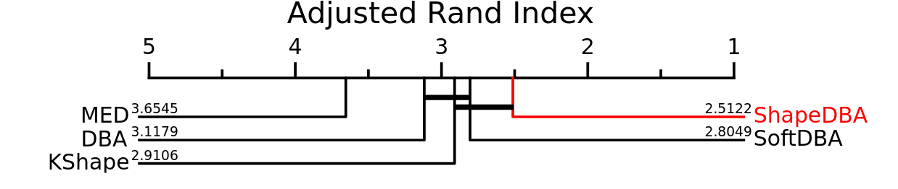
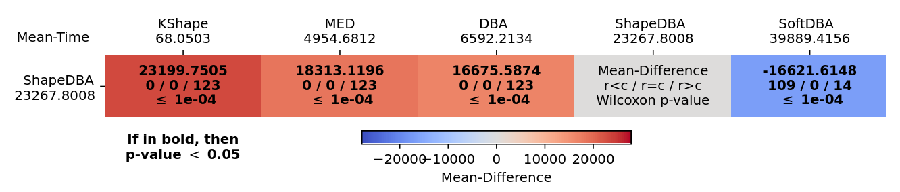
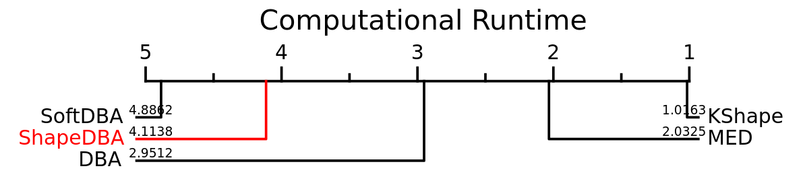

# ShapeDBA: Generating Effective Time Series Prototypes using ShapeDTW Barycenter Averaging

## This is now available in [aeon-toolkit](https://github.com/aeon-toolkit/aeon) !

Simply run the following:
```
from aeon.datasets import load_classification
from aeon.clustering.averaging import elastic_barycenter_average

X, y = load_classification(name="Coffee")
average_class_0 = elastic_barycenter_average(X[y == 0], distance="shape_dtw", reach=15)
```

This repository contains the code of our paper "[ShapeDBA: Generating Effective Time Series Prototypes using ShapeDTW Barycenter Averaging](https://germain-forestier.info/publis/aaltd2023.pdf)" accepted at [8th Workshop on Advanced Analytics and Learning on Temporal Data (AALTD 2023)](https://ecml-aaltd.github.io/aaltd2023/) in conjunction with the [2023 European Conference on Machine Learning and Principles and Practice of Knowledge Discovery in Databases](https://2023.ecmlpkdd.org/).<br>

This work was done by [Ali Ismail-Fawaz](https://hadifawaz1999.github.io/), [Hassan Ismail Fawaz](https://hfawaz.github.io/), [Fran ̧cois Petitjean](https://www.francois-petitjean.com/), [Maxime Devanne](https://maxime-devanne.com/), [Jonathan Weber](https://www.jonathan-weber.eu/), [Stefano Berretti](http://www.micc.unifi.it/berretti/), [Geoffery I. Webb]() and [Germain Forestier](https://germain-forestier.info/).

## Summary figure

<p align="center" width="100%">

</p>

## Usage of code

Before doing anything, run the following command in root directory to build the necessary `cython` components of the Dynamic Time Warping (DTW) algorithm and its variants.

```./utils/build-cython.sh```

In order to use the code, first step is to adapt it to your own machine as follows:

1. You should download the datasets of the [UCR Archive](https://www.cs.ucr.edu/~eamonn/time_series_data_2018/)
2. The directory containing the dataset of the UCR Archive should be put in the variable `root_dir_dataset_archive` in [this line of the main.py file](https://github.com/MSD-IRIMAS/ShapeDBA/blob/b6217761a98d6b531dc3d55e7a34bb2118c2afd3/main.py#L73)
3. Specify the `root_dir` directory where the results will be stored in [this line of the main.py file](https://github.com/MSD-IRIMAS/ShapeDBA/blob/b6217761a98d6b531dc3d55e7a34bb2118c2afd3/main.py#L71)

Two options can be chosen when running the `main.py` file:

1. Visualize the resulted average per class of a dataset using the following command:<br>
```python3 main.py visualize_average <dataset_name> <archive_name> <averaging_method>```<br>
An example would be: ```python3 main.py visualize_average Coffee UCRArchie_2018 shapeDBA```<br>
The `<archive_name` should be the same name as the directory containing the datasets, for instance the directory of the dataset should be `root_dir_dataset_archive + '<archive_name>/Coffee'`<br>
The choices for the `<averaging_method>` are: mean, DBA, softDBA and ShapeDBA
2. Generate the clustering results of the paper. First in [this line of the constants.py file](https://github.com/MSD-IRIMAS/ShapeDBA/blob/b6217761a98d6b531dc3d55e7a34bb2118c2afd3/utils/constants.py#L19), you can choose which datasets to use in the study by edditing the `UNIVARIATE_DATASET_NAMES_2018` list variable.<br>
Then you can produce the results by running the following command: ```python3 main.py data_clustering```

## Results

#### We compared the usage of Kmeans with Euclidean Distance, DBA, softDBA and ShapeDBA as well as the Kshape algorithm following the ARI metric and the running time.
We present in what follows both the [Multi-Comparison Matric (MCM)](https://github.com/MSD-IRIMAS/Multi_Comparison_Matrix) and the [Critical Difference Diagram (CDD)](https://github.com/hfawaz/cd-diagram) of both studies.

### ARI

<p align="center" width="100%">

</p>
<p align="center" width="100%">

</p>

### Computational Runtime

<p align="center" width="100%">

</p>
<p align="center" width="100%">

</p>

## Requirements

```
numpy==1.24.3
tslearn==0.5.3.2
matplotlib==3.7.1
cython==0.29.34
pandas==2.0.1
sklearn==1.2.2
scipy==1.10.1
```

# Citation

If you use this work please cite the following corresponding paper:
```
@inproceedings{ismail-fawaz2023shapedba,
  author = {Ismail-Fawaz, Ali and Ismail Fawaz, Hassan and Petitjean, François and Devanne, Maxime and Weber, Jonathan and Berretti, Stefano and Webb, Geoffrey I and Forestier, Germain},
  title = {ShapeDBA: Generating Effective Time Series Prototypes using ShapeDTW Barycenter Averaging},
  booktitle = {ECML/PKDD Workshop on Advanced Analytics and Learning on Temporal Data},
  city = {Turin},
  country = {Italy},
  year = {2023},
}
```

# Acknowledgments

This work was supported by the ANR DELEGATION project (grant ANR-21-CE23-0014) of the French Agence Nationale de la Recherche. The authors would like to acknowledge the High Performance Computing Center of the University of Strasbourg for supporting this work by providing scientific support and access to computing resources. Part of the computing resources were funded by the Equipex Equip@Meso project (Programme Investissements d’Avenir) and the CPER Alsacalcul/Big Data. The authors would also like to thank the creators and providers of the UCR Archive.